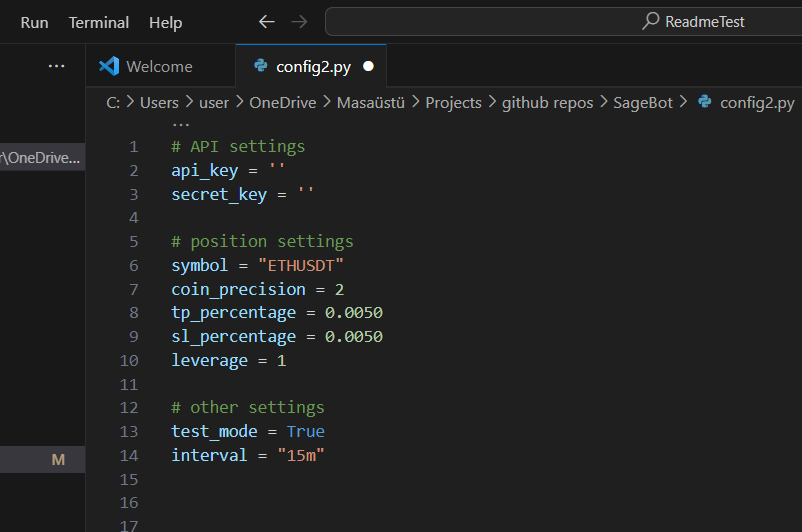
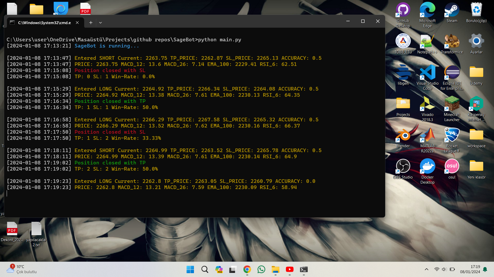
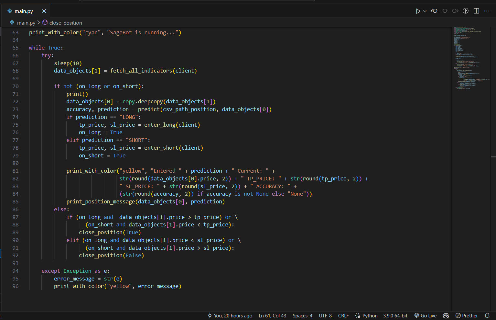

<div align="center">
    <h1> SageBot </h1>
    
</div>

## Table of Contents

- [Description](#description)

- [Technologies Used](#technologies-used)

- [Installation](#installation)

- [Configuration](#configuration)

- [Running the bot](#running-the-bot)

- [Editing the Code](#editing-the-code)
 
- [Warnings](#warnings) 


## Description

SageBot, an experimental project crafted for the purpose of exploring the capabilities of artificial intelligence in cryptocurrency trading decisions. This innovative initiative is not a commercial product but rather an exploration into the realms of AI-supported decision-making for trading. 
SageBot serves as a tool for users interested in experimenting with automated strategies for entering "LONG" or "SHORT" positions in the cryptocurrency market, particularly in assets like Bitcoin. 
Designed with a non-commercial ethos, SageBot aims to provide a platform for enthusiasts and learners to engage with AI-powered trading concepts, fostering a deeper understanding of the intricate dynamics within the crypto landscape.

<div align="center">
    
</div>

## Technologies Used

1. **Python:** The primary programming language driving SageBot's functionality and logic.

2. **TensorFlow Library:** Leveraging the power of TensorFlow for machine learning applications, enhancing SageBot's ability to analyze market trends and make informed decisions.

3. **Binance API:** SageBot connects seamlessly to the Binance cryptocurrency exchange through its API, allowing real-time access to market data and execution of trades.

4. **TA-Lib Library:** Technical Analysis Library provides essential functions for technical analysis of financial markets, aiding SageBot in evaluating market indicators.

5. **ChatGPT:** ChatGPT, powered by OpenAI, is employed for code assistance, aiding developers in coding tasks and providing guidance on library usage. Additionally, ChatGPT is utilized for crafting informative log messages, enhancing communication and facilitating a smoother understanding of SageBot's operations.

<div align="center">
    <p> 
        <a href="https://www.python.org/">  </a>
        <a href="https://www.tensorflow.org/">  </a>
        <a href="https://github.com/sammchardy/python-binance">  </a>
        <a href="https://pypi.org/project/TA-Lib/">  </a>
        <a href="https://chat.openai.com/chat" target="_blank">  </a>
    </p>
</div>

## Installation

To install Project, follow these simple steps:

1.  **Install Python:**  
	- Visit [Python official website](https://www.python.org/downloads/) and download python. 
	- I strongly recommend downloading a version lower than 3.10 and higher than 3 to ensure that you can download it without any issues and run the Talib library smoothly.
2. **Cloning the Project into your local:**
    Go to the directory where you want to download the project using 'cd', and then type the following command
    ```bash
    $git clone https://github.com/basaryldrm06/SageBot
    ```
3. **Install Dependencies**
    Enter these commands in sequence.
    ```bash
    $cd SageBot
    $pip install -r requirements.txt
    ```

Upon successfully completing these steps, proceed to configure your settings and run the program.

In case you encounter any issues, kindly attempt to resolve them before moving forward.

If you are facing difficulties downloading the Talib library, consider trying a manual download from this [link](https://www.lfd.uci.edu/~gohlke/pythonlibs/).

# Configuration
Rename the file config2.py to config.py.

Open the config.py file to edit the settings, and fill in the empty fields according to your preferences.

<div align="center">
    
</div>

If you do not have an api key you can obtain one from this [link](https://www.binance.com/en/my/settings/api-management)

You can use the default values for other sections or customize them based on your preferences.

Once you have finished editing your settings, you will be ready to run the program.

## Running the Bot
If you have completed the previous steps, SageBot is now ready to run. Start it by entering the following command:

 ```bash
$python main.py
```

After running the command, you should see a screen similar to the one below.

<div align="center">
    
</div>

## Editing the Code
Feel free to tailor the project to your specific preferences and requirements. The code has been meticulously documented to provide clear explanations of each component, empowering you to make effortless customizations. Whether you want to tweak parameters, integrate additional features, or adapt the functionality to suit your needs, the codebase is designed to be intuitive and easily adaptable. 

<div align="center">
    
</div>


## Warnings
This trading bot is developed solely for experimental purposes, aiming to explore the viability and effectiveness of using deep learning in financial transactions. It is a completely experimental project shared as open-source to serve as an example for the development of trading bots.

Any profits or losses incurred using this bot are entirely your responsibility. Please refrain from using the program if you are not familiar with its functionalities. Understand that engaging in financial transactions carries inherent risks, and it's crucial to exercise caution and knowledge when utilizing this bot.


## Last Words from Developer
I hope you find this project useful and enjoyable.

Feel free to follow my account for more projects like this and stay updated on upcoming releases. Don't forget to star and watch this project to receive notifications about future updates and improvements.

Artificial intelligence is one of the most significant inventions of our era, with a wide range of applications. While working on this project, my idea was to explore the extent to which the power of artificial intelligence could be applied to financial transactions. For this reason, this project was particularly intriguing and enjoyable for me.

If you have any innovative ideas in mind for trading bots or AI, feel free to reach out to me through the links on my profile. We can collaborate and develop something together.

Thank you for your interest and support! 🚀